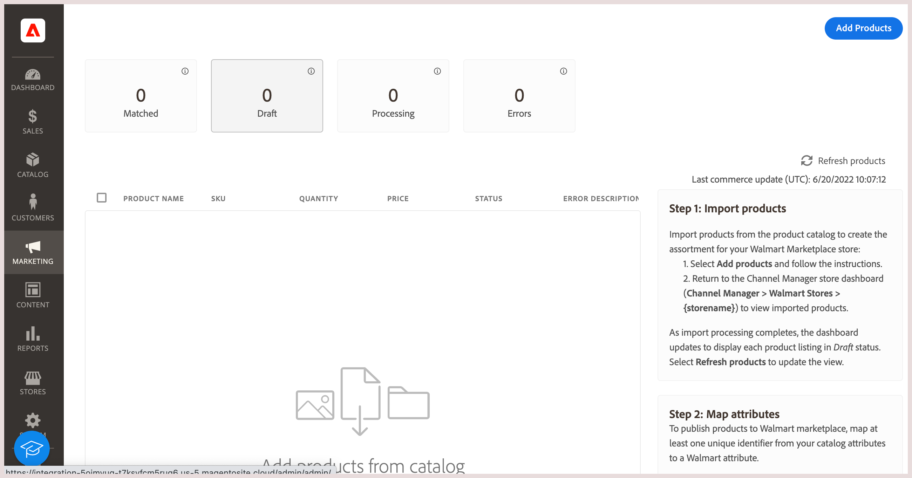
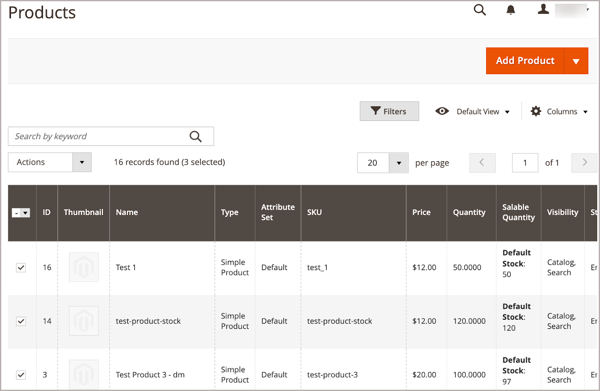

# Add products to [!DNL Channel Manager]

You add product to the [!DNL Walmart Marketplace] sales channel by selecting products from the [!DNL Commerce] product catalog and importing them to [!DNL Channel Manager].
The import process can take up to 30 minutes or more depending on how many products you select.

**Prerequisite**

**[Map catalog attributes](map-catalog-attributes.md)**—In the [!DNL Channel Settings] configuration, map at least one attribute from the [!DNL Commerce] product catalog to one of the required Walmart Product Identifiers—–GTIN, ISBN, ISSN, UPC, EAN.

**Listing requirements**

[!DNL Commerce] product listings must have the following required attribute configuration:

- **[!UICONTROL Connect to Channel Manager]** attribute is enabled

- Provide valid values for the required Walmart attributes.

  - At least one product attribute that matches one of the required [!DNL Walmart Marketplace] product identifiers–GTIN, ISBN, ISSN, UPC, EAN.

  - Product price value specified as a value with a maximum of two decimal places, for example `9.99`

  - Product weight specified as value with a maximum of two decimal places, for example `1.25`

>[!TIP]
>
>For additional information about optimizing listings for your sales channel, see the [Walmart Marketplace Listing Quality Optimization Guide](https://marketplace.walmart.com/wp-content/uploads/2020/09/WMP_listing_quality_optimization_guide.pdf).

## Add products

1. From a connected sales channel store, select **Add products** to open the product catalog.
   
   

   The catalog opens in a new tab.

1. From the catalog product grid, select products to sell on [!DNL Walmart Marketplace].

   

1. Enable the **[!UICONTROL Connect to Channel Manager]** attribute for the selected items.

   - From **[!UICONTROL Actions]**, select **[!UICONTROL Update attributes]**.

   - Scroll to the **[!UICONTROL Connect to Channel Manager]** attribute and enable it.

   - Verify that the product attributes include at least one of the required [!DNL Walmart Product IDs].

   - Select **[!UICONTROL Save]**.

     A confirmation message displays.

     

     If the message indicates that the update is scheduled, use the [queue:consumers:start](https://devdocs.magento.com/guides/v2.4/config-guide/cli/config-cli-subcommands-queue.html) [!DNL CLI] command to process the update immediately.

     ```bash
     $ bin/magento queue:consumers:start product_action_attribute.update
     ``` 

1. After the import operation completes, verify the products that you added by returning to [!DNL Channel Manager] and selecting **[!UICONTROL Listings]**.

   

   Initially, the products are in *Draft* status. Select **[!UICONTROL Refresh products]** to update the table.
   
