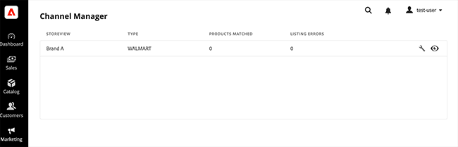

# Complete sales channel setup

After you connect a Commerce store to [!DNL Walmart Marketplace], complete store setup from the [!DNL Channel Manager] home page.

1. From the Admin, select **[!UICONTROL Marketing** > **Channel Manager**].

   

1. Open the sales channel store by selecting the eye icon for the store.

1. Begin sales channel operations.

   - [Configure channel settings for product identifiers and shipping carriers](settings-overview.md)

   - [Add products from your [!DNL Commerce Catalog] to Channel Manager](add-products-to-channel-store.md)

   - [Connect product listings to [!DNL Walmart] using product matching](connect-listings-to-marketplace.md)

   - [Learn how [!DNL Channel Manager] syncs inventory and price updates between [!DNL Commerce] and [!DNL Walmart]](inventory-and-price-updates.md)

   - [View and manage [!DNL Walmart] orders from the [!DNL Commerce Admin]](manage-orders.md)

After you create the sales channel and match products to [!DNL Walmart Marketplace], you can manage all product listing, inventory, price, order, shipping, and cancellation operations from [!DNL Commerce]. Product inventory, pricing, and order data is synchronized automatically from [!DNL Commerce] to [!DNL Walmart Marketplace]. To prevent conflicts or discrepancies between [!DNL Commerce] and [!DNL Walmart Marketplace] updates, do not update product or order data for [!DNL Commerce] products from the [!DNL Walmart Marketplace] account. 

>[!IMPORTANT]
>
>If [!DNL Channel Manager] returns errors during order processing, you might need to complete order, shipping, or cancellation operations from the [!DNL Walmart Marketplace]. See [Fix order errors](process-orders.md#fix-order-errors).
