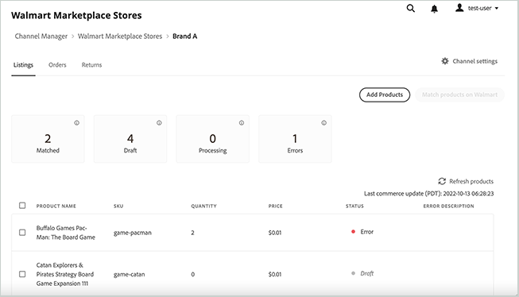

# Manage listings

Manage product listings for the [!DNL Walmart Marketplace] sales channel from the Channel Manager UI.

The Status for an individual listing indicates where the product is in the [!DNL Channel Manager] workflow so you can determine next steps and resolve any errors.

You can complete the following tasks from the Listing view.

* View current listings
* Sort and filter the listings
* Add products
* Match products
* Track listing status
* Review error description for listings with an error status

## View product listings

1. From the Admin, go to [!UICONTROL **Marketing** > **Channel Manager**].

1. From the Store list, select the eye icon in a store entry row to open the store view.

1. Select [!UICONTROL **Listings**].

1. Sort the *Listing* view by selecting any column heading in the *Listing* table.

1. Filter the *Listing* view by selecting one of the status count cards.

1. Reset the sort order and remove filters by selecting **Refresh products**.

## Add [!DNL Commerce] products to Channel Manager

Create the product assortment for the [!DNL Walmart Marketplace] channel by completing the following tasks:

* [Add products from your [!DNL Commerce] product catalog to [!DNL Channel Manager]](add-products-to-channel-store.md)

* [Map catalog attributes](map-catalog-attributes.md#configure-product-attribute-settings)

## Match products on [!DNL Walmart]

You can create product offers on the [!DNL Walmart Marketplace] using product matching or by manually uploading product listings for new products.

* **[Match products on Walmart](connect-listings-to-marketplace.md)**—Connect product listings from your channel to [!DNL Walmart Marketplace] by updating existing listings selling the same product. Match criteria are determined by the [attribute-mapping configuration](map-catalog-attributes.md) for your channel.

* **[Manually upload new listings](connect-listings-to-marketplace.md#upload-new-product-listings)**—For products that do not match an existing listing on [!DNL Walmart Marketplace], use a [!DNL Walmart] product category Excel template to bulk upload product listings.

## Listing Controls and Column Descriptions

The following tables describe the controls and columns available for [!UICONTROL Listings].

**Controls for [!UICONTROL Listings]**

| **Control**                            | **Description**                                                                                                                                                                                              |
|----------------------------------------|--------------------------------------------------------------------------------------------------------------------------------------------------------------------------------------------------------------|
| [!UICONTROL Add Products]              | Opens the [!UICONTROL Admin Product Catalog] page to select products to add to your [!DNL Walmart Marketplace] assortment, or to update product attributes to meet Walmart Marketplace listing requirements. |
| [!UICONTROL Match products on Walmart] | After selecting one or more products in Draft status, select Match products on [!DNL Walmart] to check for product offers that can be added to an existing [!DNL Walmart Marketplace] listing.               |
| [!UICONTROL Refresh products]          | Update the display with the most current listing and status. This control also resets the listing view to the default sort order and removes any filters.                                                    |
| [!UICONTROL Filter by *Status*]        | Show only listings with a specific status by selecting one of the status count cards above the Listing table. Use the *Refresh products* to remove the filter.                                               |
| [!UICONTROL Sort products]             | Change the sort order for listing by selecting any column header.                                                                                                                                            |

**Column descriptions**

| **Field**                      | **Description**                                                                                                                                                                                                                                                                                                                                                   |
|--------------------------------|-------------------------------------------------------------------------------------------------------------------------------------------------------------------------------------------------------------------------------------------------------------------------------------------------------------------------------------------------------------------|
| [!UICONTROL Product name]      | Name of the product from the [!DNL Commerce] store catalog.                                                                                                                                                                                                                                                                                                       |
| [!UICONTROL SKU (Unique ID)]   | The SKU assigned to the product in the [!DNL Commerce] catalog.                                                                                                                                                                                                                                                                                                   |
| [!UICONTROL  Quantity]         | Amount of inventory available in Adobe Commerce or Magento Open Source.                                                                                                                                                                                                                                                                                           |
| [!UICONTROL Price]             | The product price from the [!DNL Commerce] store catalog. Catalog price updates are synced to Channel Manager, and then sent to [!DNL Walmart Marketplace]  so that listed items show the current price.                                                                                                                                                          |
| [!UICONTROL Status]            | Indicates the current order status in the [!DNL Commerce] order workflow. The status updates when you successfully add products to [!DNL Channel Manager] and when you match products on the marketplace. If an operation fails, the listing shows an error status. After you fix the error, [!DNL Channel Manager] retries the operation and updates the status. |
| [!UICONTROL Error Description] | Provides additional error information for products with an `[!DNL Error]` status.                                                                                                                                                                                                                                                                                 |
| [!UICONTROL Status Detail]     | Provides additional information for products with *Error* or *Match* status.                                                                                                                                                                                                                                                                                      |

### About Listing Status              

In the Listing workspace, the Status label shows where a product is in the [!DNL Channel Manager] workflow so you can determine next steps and resolve errors. Listings can have the following status labels:

*  **[!UICONTROL Draft]**–Identifies products that have not been [submitted to [!DNL Walmart] for matching](connect-listings-to-marketplace.md#match-products).

*  **[!UICONTROL Processing]**—Identifies products submitted for matching on the [!DNL Walmart Marketplace]. Products remain in *Processing* status until the [!DNL Walmart] returns an HTTP status message that indicates whether the match was successful, or if there was an error. It can take up to 30 minutes for the match operation to complete on the [!DNL Walmart Marketplace].

* **[!UICONTROL Match]**–Identifies products that were matched successfully on [!DNL Walmart].
    
    A match occurs when the product attribute value—UPC code for example—matches the UPC value in an existing [!DNL Walmart Marketplace] listing. When a product matches, the Commerce product offer is added to the existing listing.

    Check the [[!UICONTROL Walmart Marketplace Seller Account Items]](https://seller.walmart.com/items-and-inventory/manage-items) dashboard to review the updated product listing and verify product details, price, and inventory quantity.  

* **[!UICONTROL Match - Match in Stage]**—Identifies products matched on [!DNL Walmart] that cannot be connected until the [!DNL Walmart Marketplace] store is live. Products with this status connect automatically when the [!DNL Walmart Marketplace] store goes live.

* **[!UICONTROL Error]**—Identifies products that were not matched to an existing [!DNL Walmart Marketplace] listing.

* **[!UICONTROL Error description]**—Provides detailed information about the listing error.

  After you resolve the error, resubmit the product for matching. See [Troubleshoot product match errors](connect-listings-to-marketplace.md#troubleshoot-product-match-errors).
