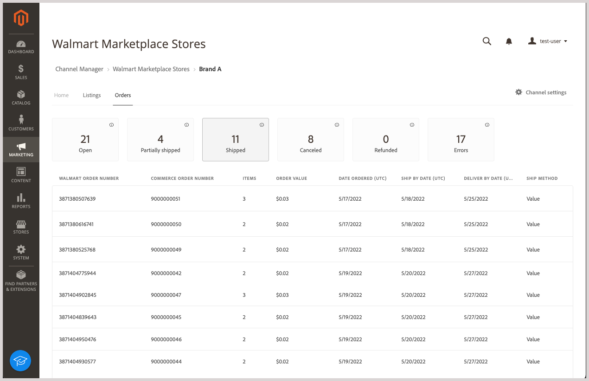
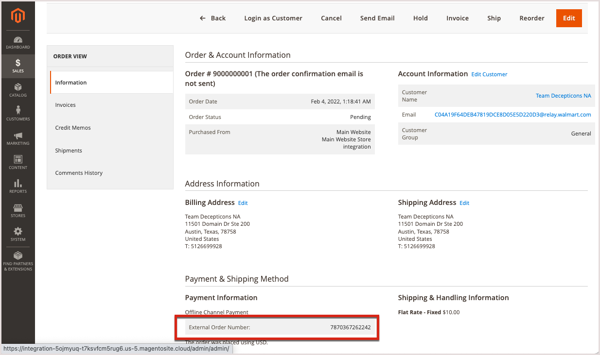

# Manage Walmart Marketplace orders

[!DNL Walmart Marketplace] orders for [!DNL Commerce] product listings sync automatically to [!DNL Channel Manager] after Walmart processes the order. When the sync is completed, you can view order information by selecting **[!UICONTROL Orders]** from the connected channel store view in [!DNL Channel Manager].

>[!NOTE]
>
>It can take up to 3five minutes for a [!DNL Walmart Marketplace] order to display in the [!DNL Channel Manager] orders list. [!DNL Walmart] requires approximately 30 minutes to process incoming orders and send them to [!DNL Channel Manager]. After Channel Manager receives the order, it takes approximately five more minutes to create and display the order in Adobe Commerce or Magento Open Source.

## Review Orders

1. From the Admin, select **[!UICONTROL Marketing]** > **[!UICONTROL Channel Manager]** to open the [!UICONTROL Channel Manager Marketplace Stores] page.

1. Open the store view by selecting the pencil icon in a store entry row.

1. To view order information, select *[!UICONTROL *Orders]**.

1. Get information about the order and determine next steps by checking the **[Status](#about-order-status)** column to get information about the orders.

## View Order Detail

After an order is received from the marketplace and imported into the Adobe Commerce or Magento Open Source, use the [!DNL Commerce] Order ID to view the order in Adobe Commerce.

From **[!UICONTROL Orders]**, select the **[!UICONTROL Commerce Order Number]** to open the [!DNL Commerce] order detail.

### Orders Controls and Column Descriptions

The following tables describe the controls and columns available for Orders.

**Controls for [!UICONTROL Orders]**
| **Control**                    | **Description**                                                                                                                                               |
|--------------------------------|---------------------------------------------------------------------------------------------------------------------------------------------------------------|
| [!UICONTROL Filter orders]     | Sort the view by selecting one of the [!UICONTROL Order Status] cards.                                                                                        |
| Error message details          | Hover over the [!UICONTROL Error Status] for an order to see the detailed error message.                                                                      |
| [!UICONTROL View order detail] | To view order details, select the [!DNL Commerce] order number in the [!UICONTROL Order] table. Then, use [!DNL Commerce] order options to process the order. |

**Column descriptions**

| Field                              | Description                                                                                                                                                                                                                                                                                                                                                                      |
|------------------------------------|----------------------------------------------------------------------------------------------------------------------------------------------------------------------------------------------------------------------------------------------------------------------------------------------------------------------------------------------------------------------------------|
| [!UICONTROL  Walmart Order Number] | The purchase order number assigned to the order in the [!DNL Walmart Marketplace]. When an order is initially imported to [!DNL Channel Manager], only the Walmart order number displays. When the [!DNL Commerce] order is created, the [!DNL Walmart] order number is stored in the [!UICONTROL External ID] product attribute.                                                |
| [!DNL Commerce]  Order Number      | The number assigned to the [!DNL Commerce]  order created from the [!DNL Walmart Marketplace] order.                                                                                                                                                                                                                                                                             |
| Items                              | Number of items ordered on [!DNL Walmart Marketplace].                                                                                                                                                                                                                                                                                                                           |
| [!UICONTROL Order Value]           | Total cost of the ordered items.                                                                                                                                                                                                                                                                                                                                                 |
| [!UICONTROL Date Created]          | The date the order was created on the [!DNL Walmart Marketplace].                                                                                                                                                                                                                                                                                                                |
| [!UICONTROL Ship By Date]          | Date the order must be shipped by to meet [!DNL Walmart Marketplace] requirements.                                                                                                                                                                                                                                                                                               |
| [!UICONTROL Order Status]          | Indicates the current order status in the [!DNL Commerce] order workflow. The status updates when you successfully add products to [!DNL Channel Manager] and when you match products on the [!DNL Walmart Marketplace]. If an operation fails, the listing shows an Error status. After you fix the error, [!DNL Channel Manager] retries the operation and updates the status. |

| [!UICONTROL Error description]    | Provides more detailed information about orders with an *Error* status.|

### About Order Status

[!UICONTROL Order Status] provides information about the current state of [!DNL Walmart Marketplace] orders managed from Adobe Commerce or Magento Open Source. Order status updates occur when [!DNL Channel Manager] receives updated order information from either the [!DNL Walmart Marketplace] or the [!DNL Commerce] order system. Orders can have the following statuses:           

*  **[!UICONTROL Open]**–Orders received from the [!DNL Walmart Marketplace] ready to be reviewed and processed in Adobe Commerce or Magento Open Source.

   After a customer orders a product from the [!DNL Walmart Marketplace], it can take up to 3five minutes for the open order to be displayed in the order workspace for the connected channel. [!DNL Commerce] requires approximately 30 minutes to process incoming orders and send them to [!DNL Channel Manager]. After Channel Manager receives the order, it takes 5 more minutes to create and display the [!DNL Commerce] order.

*  **[!UICONTROL Processed]**–Orders that have been shipped, canceled, or refunded from the [!DNL Commerce] store.

   To show all shipped, canceled, and refunded orders, select the **Processed** status card.

* **[!UICONTROL Canceled]**–Orders that have been canceled from the [!DNL Commerce] store.

  After the order cancellation completes, the [!DNL Commerce] stock quantity updates to reflect returned items. Then, [!DNL Channel Manager] syncs the update to the [!DNL Walmart Marketplace].

* **[!UICONTROL Refunded]**–Orders that have been refunded from the [!DNL Commerce] store.

  After the refund completes, the [!DNL Commerce] stock quantity updates to reflect the refunded items. Then, [!DNL Channel Manager] syncs the update to the [!DNL Walmart Marketplace].

* **[!UICONTROL Error]**– Orders that have errors. Errors can occur when an order update operation fails. For example, errors occur if [!DNL Channel Manager] cannot receive a new order from Walmart. They can also occur if [!DNL Channel Manager] cannot send an order shipment or cancellation update to the [!DNL Walmart Marketplace]. 

* **[!UICONTROL Error description]**–Provides detailed information about order errors that occur due to issues like 
missing information or required fields, incorrect shipment details, or a failed order cancellation. The description helps determine whether error occurred on the [!DNL Commerce] instance or on the [!DNL Walmart Marketplace].
