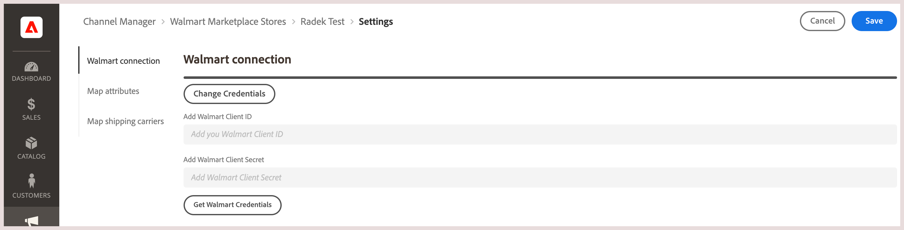

# Map shipping carriers

Before you [process order shipments](process-orders.md#ship-an-order) for [!DNL Walmart Marketplace] orders, map Walmart preferred shipping carriers to the corresponding carrier in [!DNL Commerce] so that the shipping data can be synchronized between [!DNL Walmart] and [!DNL Commerce].

Commerce carriers that do not map to a preferred carrier are labeled as *[!UICONTROL Other Carrier]* on [!DNL Walmart].

**Prerequisites**

Review [Walmart Requirements](walmart-requirements.md) for the [!DNL Marketplace Seller account].

## Update connection credentials

1. On the [!UICONTROL Listings] page for the sales channel store, select **[!UICONTROL Channel Settings]**.

1. On **[!UICONTROL Channel Settings]**, select **[!UICONTROL Walmart Connection]**.

1. To modify the credentials, select **[!UICONTROL Change Credentials]**

   

1. Enter the **[!UICONTROL Walmart Client ID]** and **[!UICONTROL Walmart Client Secret]**.

1. Select **[!UICONTROL Save]** to apply the configuration.
