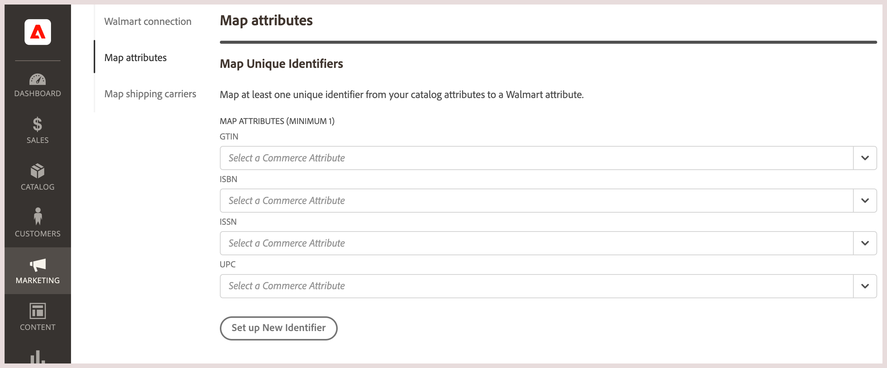

# Map catalog attributes

Before you publish listings from [!DNL Commerce] to [!DNL Walmart Marketplace], you must map at least one unique identifier from your [!DNL Commerce] catalog to the corresponding identifier from Walmart. 
This step is required to match [!DNL Commerce] products to existing [!DNL Walmart] listings and to synchronize product data between [!DNL Commerce] and [!DNL Walmart].

For product matching, the [!DNL Commerce] product must have at least one product attribute that matches one of the following Product Identifiers (Product IDs) required by [!DNL Walmart].

**Required [!DNL Walmart] product IDs**                                                                                              

| **Accepted Type** | **Name**                             | **Purpose**                                                                                                                                      | **Acceptable Digits** |
|-------------------|--------------------------------------|--------------------------------------------------------------------------------------------------------------------------------------------------|-----------------------|
| GTIN              | Global Trade Item                    | General purpose, used worldwide                                                                                                                  | 14 digits             |
| ISBN              | International Standard Book Number   | Paperback, Hardcover and Electronic Books                                                                                                        | 10 or 13 digits       |
| ISSN              | International Standard Serial Number | 8-digit serial number used to identify magazines, journals, newspapers, and periodicals of all kinds delivered on all media–print and electronic | 8 digits              |
| UPC               | Universal Product Code               | Standard retail tracking code                                                                                                                    | 12 digits             |

If your catalog does not have a matching attribute, [add or convert an existing catalog attribute](https://docs.magento.com/user-guide/catalog/product-attributes.html).

## Map unique identifiers

1. On the [!UICONTROL Listings] page for the sales channel store, select **[!UICONTROL Settings]**.

   - Find the [!DNL Walmart Marketplace] attribute to map.

   - Select the corresponding attribute from the [!DNL Commerce] store catalog.

     The following example maps the [!UICONTROL Walmart Marketplace UPC] attribute to the UPC attribute in the product catalog.  

    
   - Optionally, you can map multiple attributes to increase matches. If you map more than one attribute, select one as the **Primary identifier**. This 

   - Select **[!UICONTROL Save]**.

## Update mapped attribute configuration

Change the Commerce product identifier for matching products by updating the mapped attribute settings.

For example, instead of matching products based on the Commerce UPC product attribute code, you can match based on the SKU. Or, map additional attributes to improve matching.

1. From the **[!UICONTROL Listings]**, select **[!UICONTROL Settings]**.

1. On the Map attribute form, change the mapped attribute configuration as needed.
