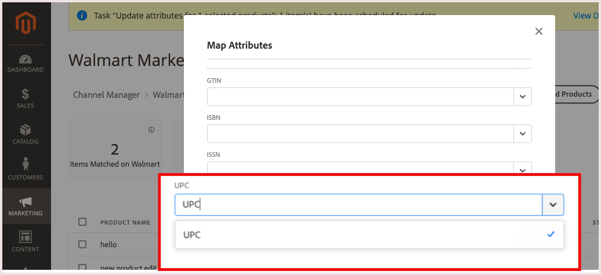

# Configure Product Matching

Before you publish listing to Walmart Marketplace, map at least one unique identifier from your product catalog attributes to one of the required Walmart Marketplace product identifiers. This step is required to match products on the Walmart Marketplace.

For product matching, the Commerce product must have at least one of the following Product Identifiers (Product IDs) in the catalog attributes.

**Required Walmart product IDs**                                                                                              

| **Accepted Type** | **Name**                             | **Purpose**                                                                                                                                      | **Acceptable Digits** |
|-------------------|--------------------------------------|--------------------------------------------------------------------------------------------------------------------------------------------------|-----------------------|
| GTIN              | Global Trade Item                    | General purpose, used worldwide                                                                                                                  | 14 digits             |
| ISBN              | International Standard Book Number   | Paperback, Hardcover and Electronic Books                                                                                                        | 10 or 13 digits       |
| ISSN              | International Standard Serial Number | 8-digit serial number used to identify magazines, journals, newspapers, and periodicals of all kinds delivered on all media–print and electronic | 8 digits              |
| ISBN              | International Standard Book Number   | Paperback, Hardcover and Electronic                                                                                                              | 12 digits             |

If you have a different type of Product ID attribute in your catalog, convert it to one of the required types. Then, map it to the corresponding Walmart Marketplace attribute in the Listing configuration for the Channel Manager store.

## Configure product attribute settings

1. On the product listing page for the connected sales channel,  select one or more products in *Draft* status.

1. Select **[!UICONTROL Settings]**.

   - Find the Walmart Marketplace attribute to map.

   - Select the corresponding attribute from the store catalog.

     The following example maps the Walmart Marketplace UPC attribute to the UPC attribute in the product catalog.  

    

   - Select **[!UICONTROL Save]**.

## Update mapped attribute configuration

Change the Commerce product identifier for matching products by updating the mapped attribute settings.

For example, instead of matching products based on the Commerce UPC product attribute code, you can match based on the SKU. Or, map additional attributes to improve matching.

1. From the **[!UICONTROL Listings]**, select **[!UICONTROL Settings]**.

1. On the Map attribute form, change the mapped attribute configuration as needed.
