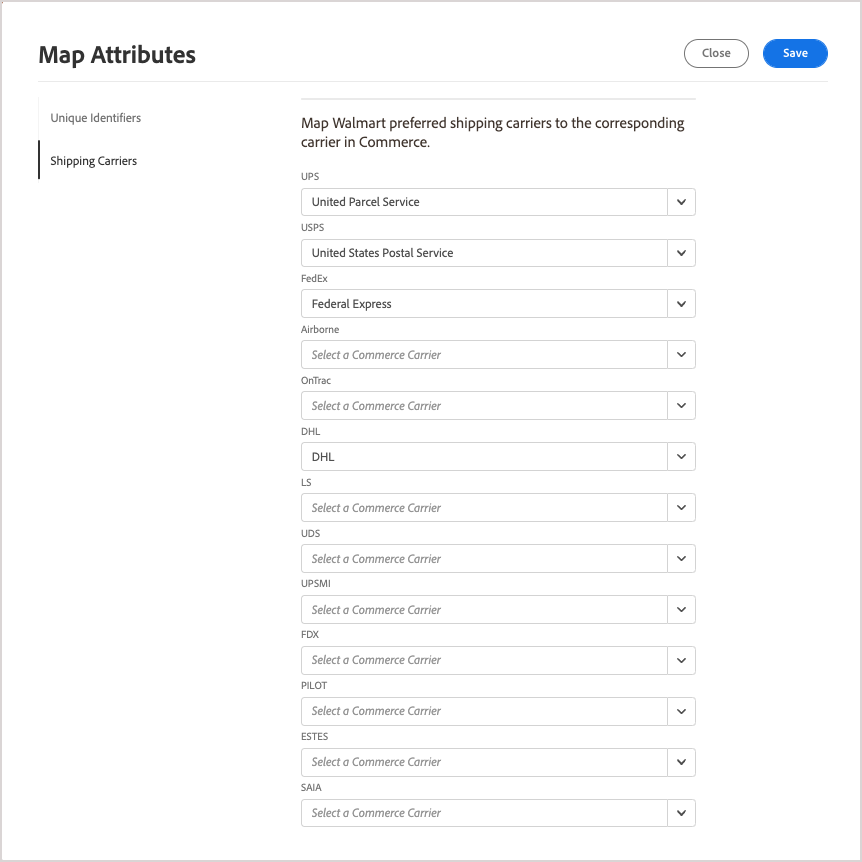

# Map shipping carriers

Before you [process order shipments](process-orders.md#ship-an-order) for [!DNL Walmart Marketplace] orders, map Walmart preferred shipping carriers to the corresponding carrier in [!DNL Commerce] so that the shipping data can be synchronized between [!DNL Walmart] and [!DNL Commerce].

Commerce carriers that do not map to a preferred carrier are labeled as *[!UICONTROL Other Carrier]* at Walmart.

**Prerequisites**

Before mapping shipping carriers, complete the following tasks:

1. Review the [Carrier Methods and Shipping Best Practices for On-Time Delivery](https://sellerhelp.walmart.com/s/guide?article=000009473) for Walmart Marketplace.

1. Verify the [[!UICONTROL Shipping Carrier]](https://docs.magento.com/user-guide/shipping/carriers.html) and [[!UICONTROL Shipping Settings]](https://docs.magento.com/user-guide/configuration/sales/shipping-settings.html) configuration in your [!DNL Commerce] store to ensure that you have optimized the configuration for [!DNL Walmart Marketplace sales].

## Map shipping carriers

1. On the [!UICONTROL Listings] page for the sales channel store, select **[!UICONTROL Settings]**.

1. From **[!UICONTROL Map Attributes]**, select **[!UICONTROL Shipping Carriers]**.

   

1. For each [!DNL Walmart] preferred carrier listed, select the [!DNL Commerce] carrier name from the dropdown if the carrier is available.

1. Select **[!UICONTROL Save]** to apply the configuration.
