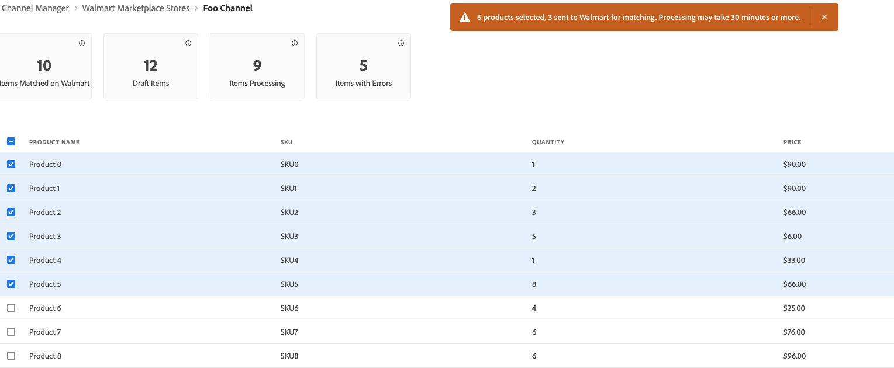

# Publish Listings to Walmart

Like other marketplaces, Walmart allows third-party sellers to list items that are sold by others. 

The platform uses product identifiers like UPC and GTIN to match items that are already for sale.
For matched products, the existing Walmart Marketplace listing updates to include the offer for the Commerce product. 
Usually, products with the lowest prices appear in the results first. But other factors like reviews also affect placement.

## Match workflow

When you match products, Channel Manager sends the product data to Walmart Marketplace to search for existing listings with attribute values that match the mapped Commerce product attribute.

If a match is found, the existing product listing is updated to add your offer. 

## Prerequisites

Before matching products, verify that your product catalog attribute values meet Walmart requirements and configure attribute settings. See [Configure product matching](map-product-attributes-for-matching.md)

## Select and match products

1. Open a connected sales channel.

1. From **[!UICONTROL Listings]**, select products for matching that are in *[!UICONTROL Draft]* status.

   

1. Select **[!UICONTROL Match Products]**.

   A message indicates the number of products sent for matching.

   

   It can take up to 30 minutes for Walmart Marketplace to complete the match operation. 
   
   The status for selected products changes to *[!UICONTROL Processing]* until the match operations completes. It can take up to 30 minutes for Walmart Marketplace to complete the match operation.

## Check match status

1.  Select **Refresh products** to update the most current product status.

1.  Check the product status.

    After the match completes, the status can be *Match* or *Error*.

    * **[!UICONTROL Match]** indicates that the product was successfully matched. Your product offer was published to an existing Walmart Marketplace listing.

    * **[!UICONTROL Error]** indicates one of the following:

      * An error occurred and the match operation failed.

      * No match was found.

      * Match found, but product published as staged because the [Marketplace store is not active](walmart-prerequisites.md#walmart-marketplace-store-status).

## Troubleshoot product match errors

If the product match operation fails, the Walmart Marketplace returns an error code and Channel Manager displays the error status in the product listing information.

View error messages detail by hovering over the **Error** status label. Common errors returned are incorrectly formatted Product ID values or missing required attributes.

## Fix Product ID values

| Type | Description                                                                                                                                                                        | Example                                     |
|------|------------------------------------------------------------------------------------------------------------------------------------------------------------------------------------|---------------------------------------------|
| UPC  | GTIN-12, the 12-digit number including check-digit.  If your UPC has fewer than 12 digits, such as UPC-E which is 8-digits, add leading zeros to meet the requirement. | Change from `45678912345` to `045678912345` |
| GTIN | GTIN-14, the 14-digit number including check-digit.  If your GTIN has fewer than 14 digits, add leading zeros  to meet the requirement.                                | Change `456789123456` to `0045678912345`    |
| EAN  | GTIN-13, the 13-digit number including check-digit.  If your EAN has fewer than 13 digits, add leading zeros to meet the requirement.                                  | Change from `4567891234` to `0004567891234` |

For details about Walmart Marketplace error codes, see the [Walmart Seller Help](https://sellerhelp.walmart.com/s/guide?article=000005844).
