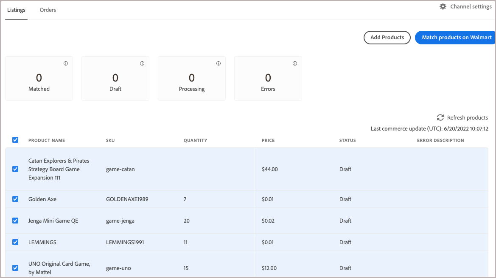
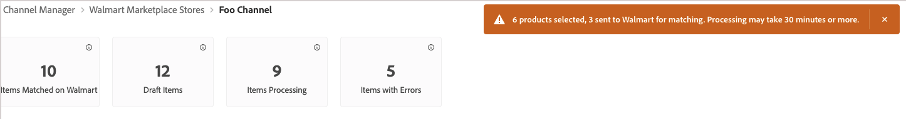
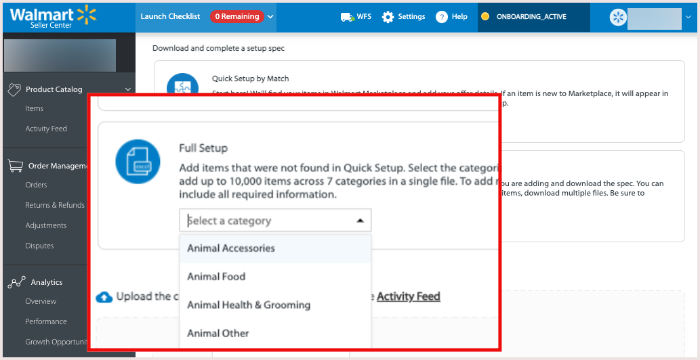

# Publish listings to Walmart

Like other marketplaces, [!DNL Walmart] allows third-party sellers to list items that are sold by others. 

The platform uses product identifiers like UPC and GTIN to match existing [!DNL Walmart Marketplace] listings.
For matched products, the Walmart Marketplace listing updates to include the Commerce product offer when you publish
a product from [!DNL Channel Manager].

Usually, product offers with the lowest prices appear first in the [!DNL Walmart Marketplace] listing, but other factors like reviews also affect placement.

## Match products

When you match products, Channel Manager sends the product data to [!DNL Walmart Marketplace] to search for existing listings with attribute values that match the mapped Commerce product attribute. Match criteria is determined by the [attribute-mapping configuration](map-catalog-attributes.md) for your store channel.

If a match is found, the existing product listing is updated to add your offer.

### Prerequisites

Before matching products, verify that your product catalog attribute values meet Walmart requirements and configure attribute settings. See [Map catalog attributes](map-catalog-attributes.md).

#### Select and match products

1. Open a connected sales channel.

1. From **[!UICONTROL Listings]**, select products for matching that are in *[!UICONTROL Draft]* status.

   

1. Select **[!UICONTROL Match Products]**.

   A message indicates the number of products sent for matching.

   
   
   The status for selected products changes to [!UICONTROL *Processing*] until the match operation completes. It can take up to 30 minutes for Walmart Marketplace to complete the match operation.

### Check match status

1.  Select **Refresh products** to view the current product status.

1.  Check the product status.

After the match completes, the status can be *Match* or *Error*.

* **[!UICONTROL Match]** indicates that the product was successfully matched. Your product offer was published to an existing Walmart Marketplace listing. If the [Marketplace store is not active](walmart-prerequisites.md#walmart-marketplace-store-status), *[!UICONTROL Staged for Match]* is displayed in the *[!UICONTROL Status detail]* column.

If your [[!DNL Walmart Marketplace] store is not active](walmart-prerequisites.md#walmart-marketplace-store-status), the *Status Detail* column indicates that the product is *Staged for Match*. Staged products are published automatically when the [!DNL Walmart Marketplace] store is activated.

* **[!UICONTROL Error]** indicates that the match operation failed due to one of the following issues:

  * [!DNL Channel Manager] could not send for matching due to a connection issue.

  * No match was found.

  * Match found, but the listing cannot be published because [!DNL Walmart Marketplace] returned an error code. See *Status Detail** for the error description.
  
### Check listing on Walmart

After matching products, review the updated product listing and verify product details, price, and inventory quantity from the [[!UICONTROL Walmart Marketplace Seller Account Items] dashboard](https://seller.walmart.com/items-and-inventory/manage-items) to review the updated product. 

### Troubleshoot product match errors

If the product match operation fails with an error, the error message is displayed in the *[!UICONTROL Status detail]* column in the [!UICONTROL Channel Manager] product listing.

Common errors returned are incorrectly formatted Product ID values or missing required attributes.

#### Fix Product ID values

| Type | Description                                                                                                                                                                    | Example                                     |
|------|--------------------------------------------------------------------------------------------------------------------------------------------------------------------------------|---------------------------------------------|
| UPC  | GTIN-12, the 12-digit number including check-digit.   If your UPC has fewer than 12 digits, such as UPC-E which is 8-digits, add ending zeros to meet the requirement. | Change from `45678912345` to `045678912345` |
| GTIN | GTIN-14, the 14-digit number including check-digit.   If your GTIN has fewer than 14 digits, add leading zeros  to meet the requirement.                           | Change `456789123456` to `0045678912345`    |
| EAN  | GTIN-13, the 13-digit number including check-digit.   If your EAN has fewer than 13 digits, add leading  zeros to meet the requirement.                            | Change from `4567891234` to `0004567891234` |

For details about Walmart Marketplace error codes, see the [Walmart Seller Help](https://sellerhelp.walmart.com/s/guide?article=000005844).

## Upload new product listings

For products that have no match on Walmart Marketplace, use a Walmart product category Excel template to bulk upload product listings. You populate the Walmart template using product catalog data exported from your Commerce instance.  

For new product listings, check your product catalog to ensure that products you plan to sell on Walmart Marketplace have the attributes required for Walmart Marketplace product listings.

**Walmart Marketplace listings–Attribute requirements**

| **Attribute**            | **Requirement level** |
|--------------------------|-----------------------|
| SKU                      | Required              |
| Product name             | Required              |
| Product ID type          | Required              |
| Product ID               | Required              |
| Brand                    | Required              |
| Short description        | Required              |
| Selling price            | Required              |
| Site description         | Required              |
| Main image URL           | Required              |
| Shipping weight          | Required              |
| Key features             | Recommended           |
| Model number             | Recommended           |
| Manufacturer name        | Recommended           |
| Manufacturer part number | Recommended           |
| Size                     | Recommended           |
| Color                    | Recommended           |
| Main image URL           | Optional              |
| Additional image URL     | Optional              |
| Manufacturer             | Optional              |

### Prerequisites

* Verify that you meet the [Walmart prerequisites](walmart-prerequisites.md).

* In your Commerce product catalog, verify that the catalog configuration for the products to list on Walmart Marketplace have all required attributes and meet Walmart Marketplace Content Guidelines.

* Verify that the cron job is running to complete the export operation.

  * For on-premises instances, see [Configure and run cron](https://devdocs.magento.com/guides/v2.4/config-guide/cli/config-cli-subcommands-cron.html).

  * For Adobe cloud infrastructure, see [Set up cron jobs](https://devdocs.magento.com/cloud/configure/setup-cron-jobs.html).

### Create the product data file to upload

1. From your [Walmart Seller account](https://login.account.wal-mart.com/authorize?responseType=code&clientId=66620dfd-1f3f-479b-8b9c-e11f36c5438b&scope=openId&redirectUri=https://seller.walmart.com/resource/login/sso/torbit&nonce=SX17QLMBKR&state=ZBWWNZXXXM&clientType=seller), download a product listing template from the Walmart Seller Center.

   * From the Product Catalog Items page, select **[!UICONTROL Add Items]**. Then, select **[!UICONTROL Add items in bulk]**. 
   
     
     
   * On the download page, select **[!UICONTROL Full Setup]**. Then, select an item category and download the category template.  

     

   * Verify that the template includes the required and recommended attributes for the product listing.

1. From the [!DNL Commerce] Admin, select the product data to export from your Adobe Commerce site.

   * From the Admin, select [!UICONTROL **System** > Data Transfer > **Export**].

   * On the [!UICONTROL Export] page in the [!UICONTROL Entity Type] field, select [!UICONTROL **Products**].

   * In the [!UICONTROL Entity Attributes] table, configure the selection criteria for the product data export.

    ![Export product data page in the [!UICONTROL Commerce Admin]](assets/walmart-seller-account-full-setup-download.png)
       
     Use filters to select and configure the attribute values that apply to the product categories that you sell in. Make sure to include Walmart’s required and recommended attributes (See [Export Data](https://docs.magento.com/user-guide/system/data-export.html) in the Adobe Commerce User Guide for detailed instructions.)
  
     To omit an attribute from the export, select the [!UICONTROL **Exclude**] checkbox at the beginning of the row.

1. Scroll to the end of the attribute table and select [!UICONTROL **Continue**] to start the data export.  
     
   The CSV export file is processed through a message queue using cron jobs and saved in the `var/export/folder`. (See [Manage message queues](https://devdocs.magento.com/guides/v2.4/config-guide/mq/manage-message-queues.html) in the *Commerce Developer Guide*.)

1. Open the Excel template for the Walmart Marketplace product category, and use Excel macro capabilities to merge the exported product data into the Excel template.

1. Upload the Excel file with the exported product data.

   * Return to the Product Catalog Items page in the [Walmart Seller Center](https://login.account.wal-mart.com/authorize?responseType=code&clientId=66620dfd-1f3f-479b-8b9c-e11f36c5438b&scope=openId&redirectUri=https://seller.walmart.com/resource/login/sso/torbit&nonce=SX17QLMBKR&state=ZBWWNZXXXM&clientType=seller).

   * Select [!UICONTROL **Add items** > **Add items in bulk**].
   * Drag the completed spreadsheet to the Upload section.
   * Select [!UICONTROL **Submit**].
   * Select the[!UICONTROL  **Activity Feed**] to view progress.

For complete instructions, see [Add Items in Bulk Using the Full Item Spec](https://sellerhelp.walmart.com/s/guide?article=000007680) in the [!DNL *Walmart Seller Help*].
